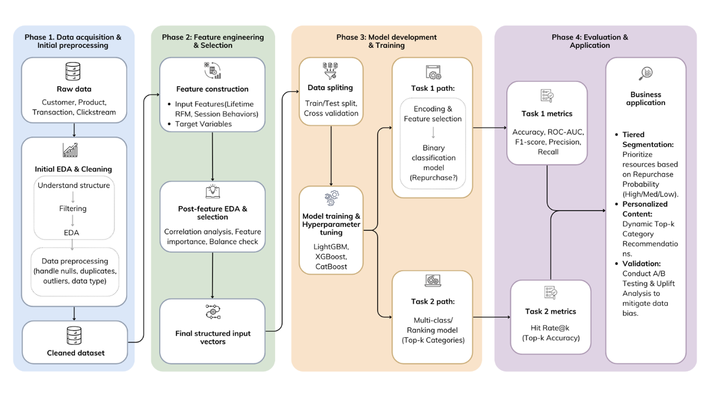
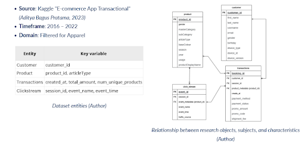
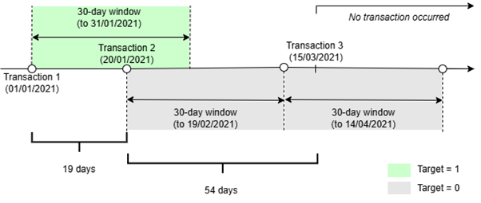
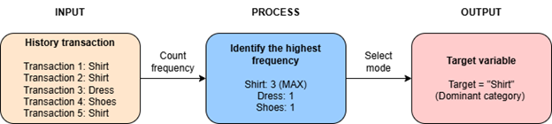
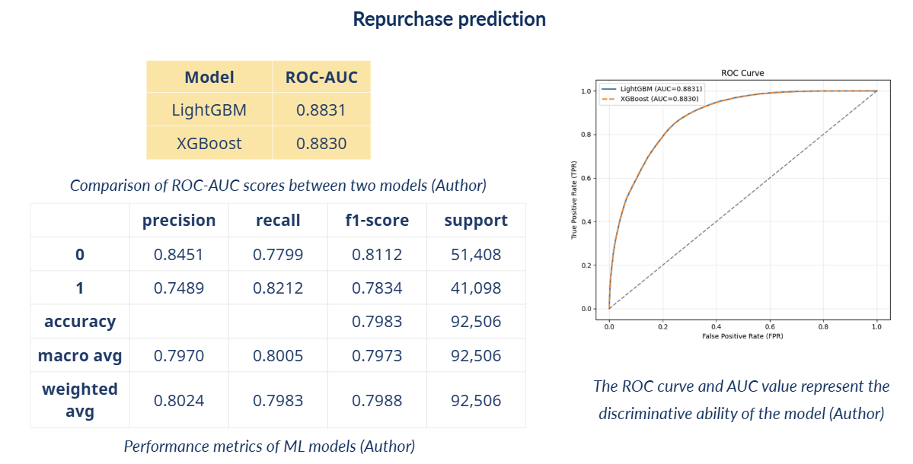
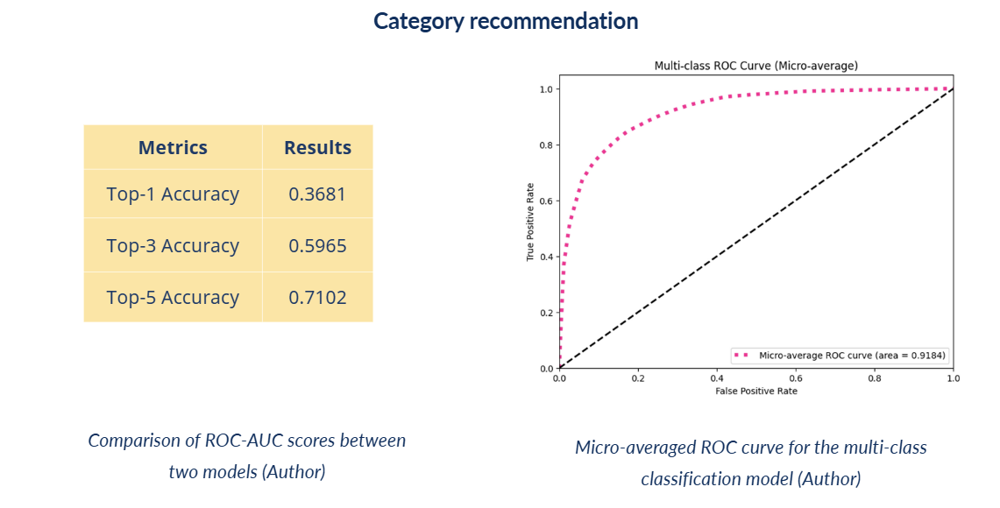

# Dual-Task Predictive Model: Repurchase & Category Recommendation in E-commerce

## 1. Background & Overview

**Problem/Context:**
* In the highly competitive Apparel e-commerce sector, customer retention is significantly more cost-effective than acquisition.
* Businesses face "choice overload," where customers struggle to navigate vast product catalogs.
* Traditional mass marketing often fails to engage users at the right time with the right products, leading to wasted marketing spend and churn.

**Objectives:**
* Build a dual-task predictive model: Repurchase prediction in a specific period of time + Category Recommendation in the fashion e-commerce industry.

---

## 2. Execution Workflow

### 2.1 Data collection

### 2.2 EDA 
Initial analysis focused on purchase frequency distribution, category popularity trends, and user engagement cycles.
* [View](https://github.com/NhiLY120504/EcommerceRepurchasePrediction_ML/blob/main/RepurchasePrediction-CategoryRecommendation_EDA.ipynb)

### 2.3 Preprocessing & Feature Engineering
After preprocessing, features are constructed based on: RFM Metrics and Session Behavior.

* [View](https://colab.research.google.com/drive/1aNQoM6ruBFFdMywScV6WkksNHkijYSPS?hl=en#scrollTo=-nlk_K74cMLf)

Target variable construction logic for Task 1

Target variable construction logic for Task 2

### 2.4 Model development & Evaluation
**Task 1 (Binary Classification):** Predicting if a customer will repurchase within 30 days, by implementing a sliding window approach to create the target labels.
**Task 2 (Multi-class Classification):** Predicting the specific product category for the next purchase.
* [View](#)

---

## 3. Results

### Task 1: Repurchase Prediction

* Achieved a high **ROC-AUC of 0.8830**, demonstrating excellent discriminative power between repurchasers and non-repurchasers.
* An **82% Recall** means the model successfully captures 82 out of 100 actual returning customers.
* **Precision (75%)** helps to optimize the budget by targeting only truly interested users.

### Task 2: Category Recommendation

* **Top-5 Accuracy** shows that when the model suggests 5 product categories to a user, there is a **71% chance** that the category they actually want is in that list.

---

## 4. Insights Deep Dive

* **Recency & Frequency** are the strongest predictors of short-term return.
* Customers who interacted or purchased recently are exponentially more likely to convert within the next 30-day window.
* Purchase intent is a blend of long-term habits and real-time session context.

---

## 5. Recommendations 

* **Smart Notifications:** Automatically trigger personalized ads or incentives for user segments with a repurchase probability > 0.70.
* **Personalized UX:** Prioritize a user's preferred categories on the interface. This reduces search friction, enhances browsing experience, and maximizes Click-Through Rates (CTR).
* **Optimized Ad Spend:** Reallocate budget from low-conversion users to "at-risk" high-probability segments, ensuring maximum Return on Ad Spend (ROAS).
* **Precision Retargeting:** Use Recency insights to deliver automated reminders just before the predicted 30-day window expires, capturing customers at their peak "ready-to-buy" moment.
* **Customer Lifetime Value (CLV) Focus:** Identify and nurture high-probability "Loyal" segments with exclusive rewards to prevent churn and increase long-term brand equity.
